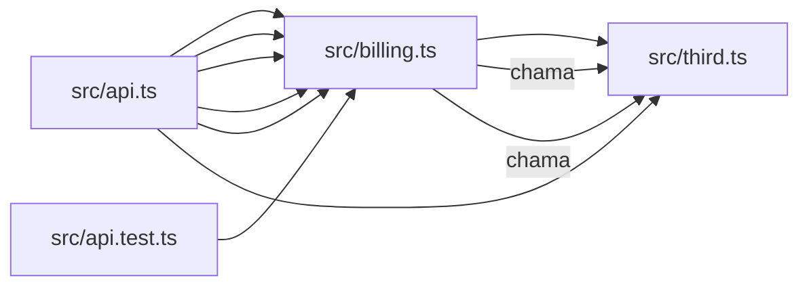

```mermaid
flowchart LR
A["src/api.ts"] --> B["src/billing.ts"]
C["src/third.ts"]
%% B["src/legacy.ts"]
A --> B--> C
A --> B -- chama --> C
A-->B-->|chama|C
T["src/api.test.ts"] --> B
A --> B & C
```
